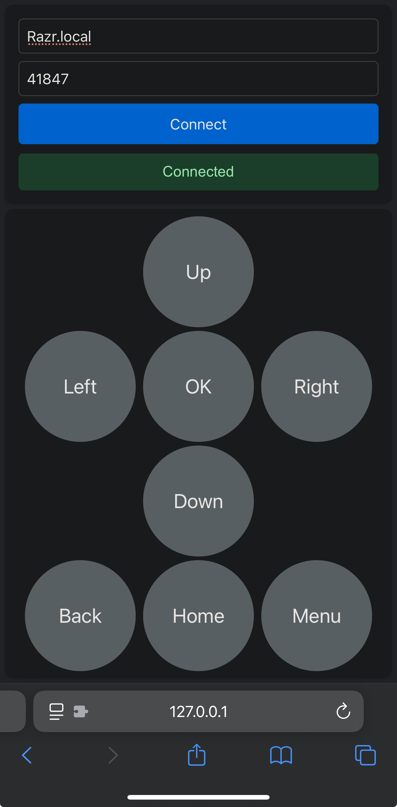

# Web-based ADB Remote Control for Regular Android Devices Running on iOS 

Android phones with DP-Alt capabilities can be easily used as TV boxes with portable monitors or TVs in a hotel room. While they can be effectively controlled with mice and keyboards, they deserve a simple remote just like a regular TV when they are functioning like one. This project serves the commonly-used buttons of a TV remote on a webpage and forward tapping events to the Android phones via ADB commands. The project can independently run on an iPhone with the help of iSH, so we can sit back in a sofa or a bed navigating through our favorite media apps all on the phone. This is what I use this project for as I primarily use iPhone for communication or whatever people typically use a smartphone for but carry a Razr 2022 around for remote desktop, simple editing, and entertainment with larger sceens, etc., basically whatever people typically use a light-weight laptop for. However, I believe you can be creative in discovering other usages.

## How to deploy on an iPhone

1. Install [iSH](https://ish.app/) if you haven't.
2. Following the Wiki [here](https://github.com/ish-app/ish/wiki/How-To-Enable-OpenRC-&-Start-Services-When-iSH-App-Starts) and [here](https://github.com/ish-app/ish/wiki/Running-in-background) to allow iSH to run in the background.
3. Update the catelog with `apk update`
4. Install `adb` with `apk add android-tools`
5. Pair you iPhone with your Android device:
   1. Enable developer options if you haven't (Google for instructions specific to your phone).
   2. Turn on wireless debugging in the developer options.
   3. Go into the settings of wireless debugging (typically by tapping on somewhere other than the toggle you just activated).
   4. Choose pair device with pair code to see the IP address, port number and pairing code.
   5. Run `adb pair <ip>:<port>` and enter the code when prompted.
   6. (optional) Set static IP for Wi-Fi networks you manage, allow always wireless debugging, disable expiration of pairing, etc.
6. Install `git` with `apk add git`
7. Clone this repository `git clone --single-branch --branch ish https://github.com/ZhangTianrong/web-adb-remote.git` and enter with `cd web-adb-remote`
8. Install `python` with `apk update && apk add python3` 
9. Install `pip` with `python3 -m ensurepip` (this can take quite some time).
10. (optional) Create a virtual environemnt, etc.
11. Install the dependencies with `python3 -m pip install requirements.txt`
12. Start the app with `python3 server.py`

## How to use the remote control
Once the app has been started, the remote control webpage can be accessed at `http://127.0.0.1:15425`. Enter the IP address and port number (note that this port is different from the one used for pairing) and click connect. Then enjoy by interacting with the buttons.

## Notes
There is also a NodeJS version but `node` and `npm` fail to run on iSH. It's just another simple web server and nothing else, but if you want to use it for, say an Android device running Termux, you can find the codes in the `master` branch.